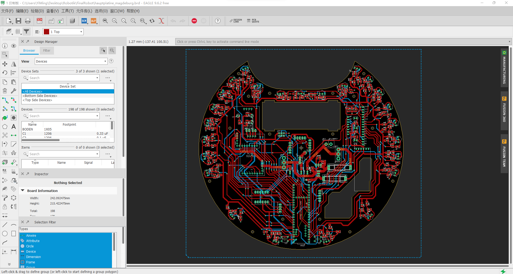
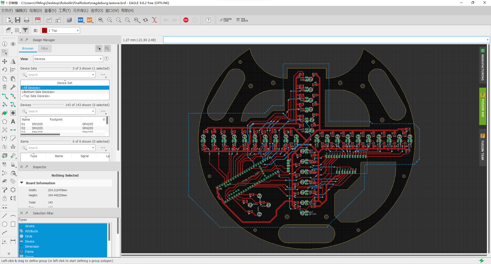
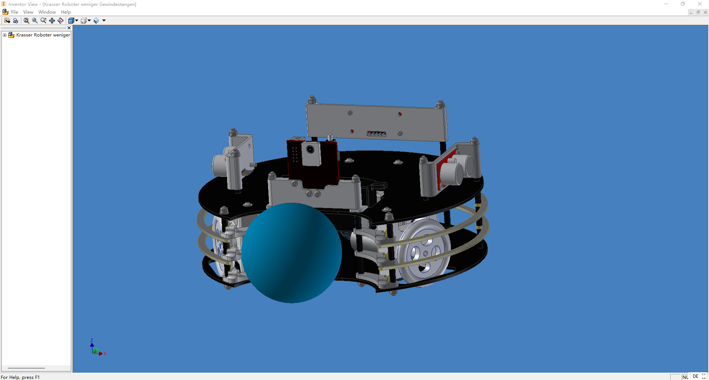

# soccer-robot
This repository contains the schematic, the board design, the mechanical design (3D CAD Models) and the code for our autonomous soccer robot when we participated in the Soccer Lightweight League at the RoboCup Junior 2019. 

The rules can be found on the following website: https://junior.robocup.org/soccer/

The design of the motherboard and the ground board was done with Autodesk Eagle. The design of the mechanical components was done with the CAD Software Autodesk Inventor. The software was written with Arduino. 

This is a video where we played against Russia in the European Championship: https://www.youtube.com/watch?v=PZbQC_VygyU

